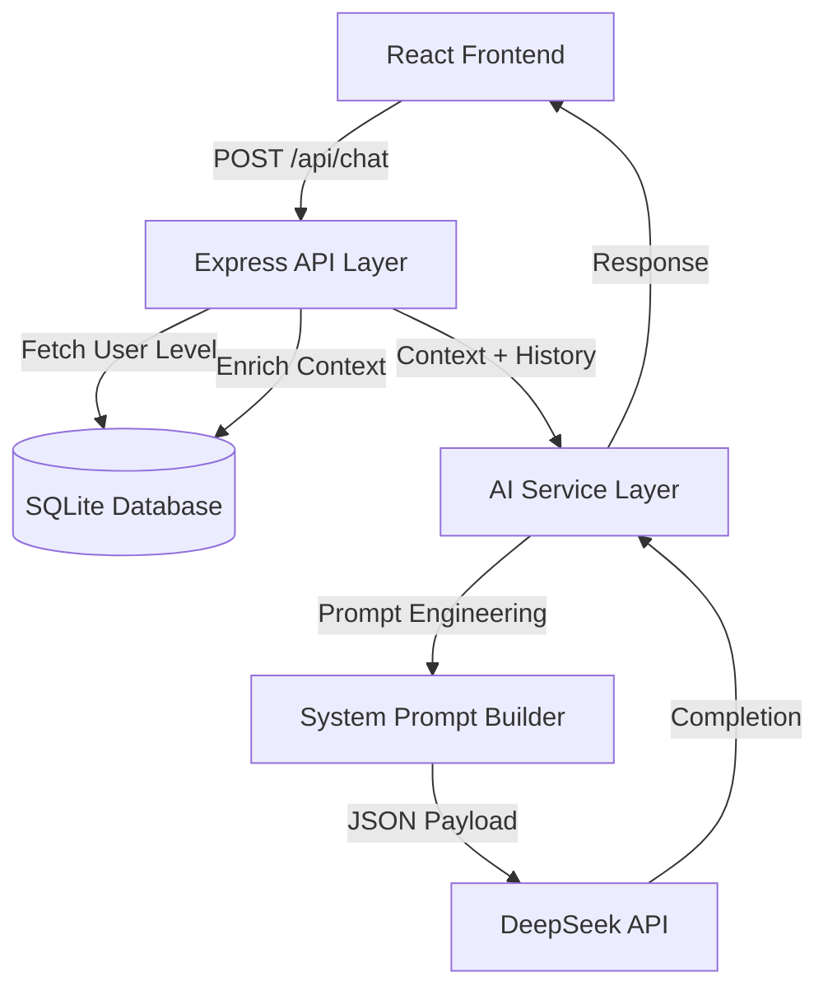

# AI Architecture & Integration Thesis Documentation

## 1. Introduction
This document outlines the architectural decisions and implementation details for the AI-powered component of the "DeepEng" educational platform. The core innovation lies in the integration of Large Language Models (LLMs) to provide personalized, context-aware tutoring, moving beyond static rule-based educational software.

## 2. Technology Selection: DeepSeek API

### Why DeepSeek?
For this thesis, **DeepSeek-V3 (Chat)** was selected as the underlying LLM for the following reasons:

1.  **Performance/Cost Ratio**: DeepSeek offers performance comparable to GPT-4 in reasoning and coding tasks but at a significantly lower inference cost, making it viable for scalable educational applications.
2.  **Scientific Relevance**: DeepSeek represents the state-of-the-art in open-weights models (as of late 2024/2025), demonstrating that high-quality tutoring does not require closed-source ecosystems.
3.  **Context Window**: The model supports a large context window (up to 128k tokens), allowing the system to maintain long tutoring sessions without losing track of previous grammatical corrections.

## 3. System Architecture

The integration follows a **Service-Oriented Architecture (SOA)** pattern within a monolithic Node.js backend.



### Data Flow
1.  **User Action**: User asks a question in the `FloatingChat` component.
2.  **Request**: Frontend sends message history + current context (e.g., `moduleId: 5`).
3.  **Enrichment**: Backend fetches the user's CEFR level (e.g., "B1") and module details from SQLite.
4.  **Prompt Construction**: The `generateSystemPrompt` function creates a dynamic instruction set.
5.  **Inference**: DeepSeek generates a response adhering to the pedagogical rules.
6.  **Response**: The answer is displayed to the user.

## 4. Prompt Engineering Strategy

To ensure the AI behaves like a teacher and not a generic assistant, we use a **Persona Pattern** with **Context Injection**.

### Dynamic System Prompt Template

```javascript
const basePrompt = `
You are "DeepEng Tutor", an expert AI English teacher.
Your goal is to help a student with English level: ${userLevel}.

Pedagogical Rules:
1. Adapt your vocabulary to the ${userLevel} level (CEFR standards).
2. If the user makes a mistake, gently correct them and explain why.
3. Keep responses concise and encouraging.
4. Never give the direct answer to a test question immediately; guide them to it.
`;
```

### Context Injection Examples

**Scenario A: General Chat**
> *Context*: "General conversation practice. Proactively ask simple questions..."

**Scenario B: Studying "Present Perfect"**
> *Context*: "The student is studying the module 'Present Perfect' (Grammar). Focus your explanations on this topic."

## 5. Implementation Details

### API Endpoint
`POST /api/chat`

**Request Body:**
```json
{
  "messages": [
    {"role": "assistant", "content": "Hello..."},
    {"role": "user", "content": "When do I use 'have been'?"}
  ],
  "context": {
    "moduleId": 12,
    "exerciseType": "grammar"
  }
}
```

**Error Handling:**
The service implements a fallback mechanism. If the DeepSeek API is unreachable (timeout or rate limit), the system degrades gracefully, informing the user without crashing the application.

## 6. Future Improvements (Thesis Discussion)
- **RAG (Retrieval-Augmented Generation)**: Indexing specific textbook materials to ground the AI's answers in the course curriculum.
- **Voice Interface**: Integrating Whisper API for speech-to-text to allow pronunciation practice.
